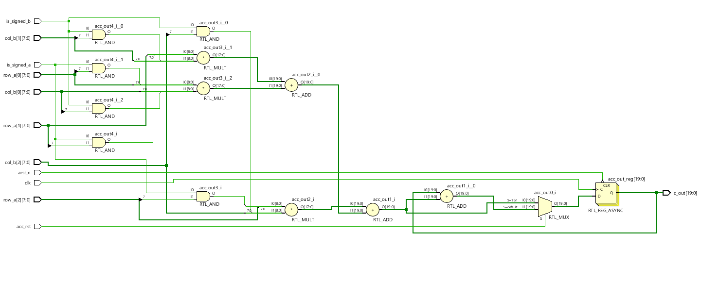
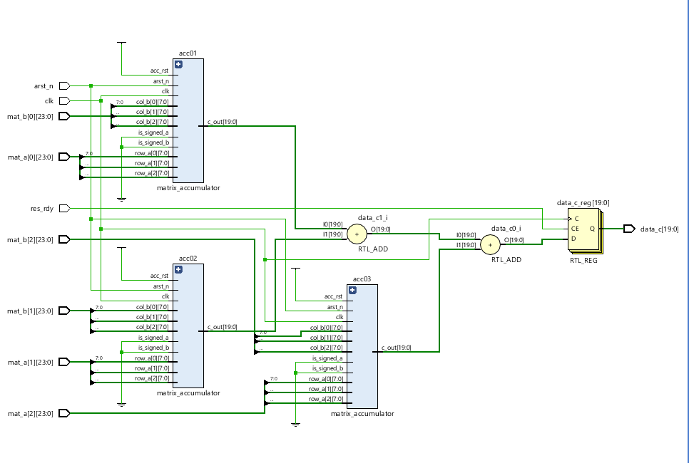
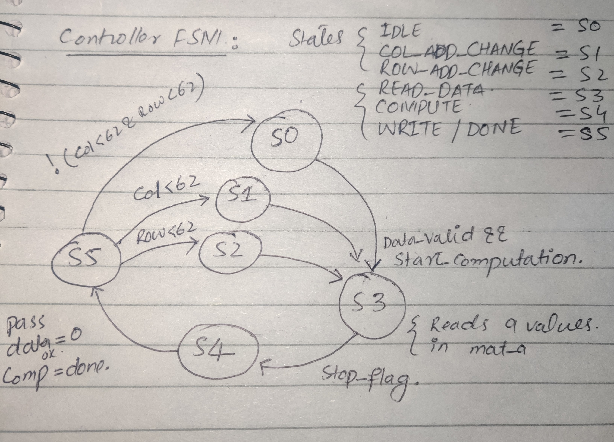
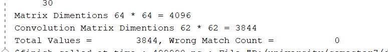

# 2D Convolution [On FPGA Using HW lang. SV]

This repo contains simple code for 2D convolution of type `valid` . The input matrix is 64 x 64 in dimension and kernel is 3 x 3 in dimension. The code is initially compiled with 8-bit data width (No Qmn format simple integers). Since, convolution is valid so the output matrix dimension is 62 x 62. The input matrix with total 4096 values (64 x 64) is provided as static memory (register). Inputs are generated by python script into a .txt file and read in a register in ram module of program, from where it is used as needed with the help of controller module, details for each modules are below.

It takes 130ns for 1 output (throughput), since total values are around 3844 (62 x 62), total time to compute result is around 499,720 ns which is 0.49ms. The program can be synthesized at 10ns clock which means around 100M frequency. 

## Dir. Structure

```

.
├── ... 
├── Conv2d.xpr                                # Vivado Project File
├── Conv2d.srcs                               # src directory
│   ├── sources_1                             #
│   	├── new                               # src files
│           ├── matrix_accumulator.sv
│           ├── tb_controller.sv
│           ├── matrix_compute.sv
│           ├── test_matrix_accumulator.sv
│           ├── Static_RAM.sv
│           └── conv2d_controller.sv
└── README.md
```


## Usage:

If You are using the [Vivado Software](https://www.xilinx.com/support/download.html) by Xilinx than running this project would be no hard. Just clone the repo and open with Vivado software, the `.xpr` file in root directory.

Before running you must change the input matrix file ( `conv_kernal.txt` and `conv_outputV2.txt` f) address in the test bench file, you also use yours but there is already script available and sample files [CLICK HERE](https://github.com/akifejaz/HwVerification#testbench-for-2d-convolution)


## Explanation

Explanation is imported if you are trying to contribute or understand how is happening. This program is divided into 3 main modules as you can see below, from bottom to up accumulator is first one which is having 1 row ( 1 x 3 dimension & 3 Values of 8 bit) of matrix and 1 row of kernel, it multiply the individual row's elements and than adds each result and return it. After that, compute unit is basically creating 3 copies/instances of accumulator module and sending them 1 row of kernel and matrix each instance. Controller is controlling the addressing from the ram and sending data in the form of 3 x 3 matrixes. You can see simple visualization of program below.


#### 1. Module matrix_accumulator

| Signal      | Description                                                 |
| ----------- | ----------------------------------------------------------- |
| clk         | clock of 10ns time period                                   |
| arst_n      | reset signal.                                               |
| row_a       | row of input main matrix 3 values of 8 bit .                |
| col_b       | row of kernel matrix 3 values of 8 bit.                     |
| is_signed_a | flag to show is matrix a (input matrix ) is signed or not . |
| is_signed_b | flag to show is matrix b (kernel matrix) is signed or not . |
| acc_rst     | flag to show completion of computation                      |
| c_out       | output matrix of 20 bits .                                  |

##### RTL of module :



#### 2. Module matrix_compute

| Signal  | Description                                       |
| ------- | ------------------------------------------------- |
| clk     | clock                                             |
| arst_n  | reset signal                                      |
| mat_a   | input of 3x3 slice of main matrix                 |
| mat_b   | input of 3x3 kernel                               |
| res_rdy | result ready flag to show computation completion. |
| data_c  | 20 bit output                                     |

#####  RTL of module :



#### 3. Module conv2d_controller

All the flow will be control by Controller unit. State diagram of Controller : 



This controller have 5 states which are clear as by name, IDEAL state will be waiting for start signal, COL_ADRR will be used for incrementing and controlling column address/values, ROW_ADRR will be used for incrementing and controlling rows address/values, READ_DATA state basically reads the data from ram with the present address values, COMPUTE state is used to send data to below module and get result.

#### Testing and Verification :

In order to test if results are correct there is a python script ( [CLICK HERE](https://github.com/akifejaz/HwVerification#testbench-for-2d-convolution)  ) that we used, which generates 64 x 64 matrix and 3 x 3 kernel and corresponding valid convolution results, all these data is written in .txt file which is later read and verified in vivado. As you can see below the code has generated total of 3844 results which are all matching with the python conv. results.





## TODOs:

- Some Code Formatting
- Multi-precision testing
